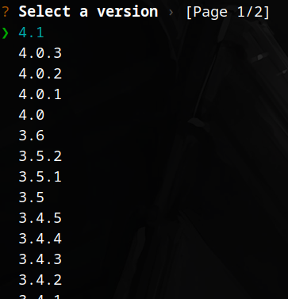
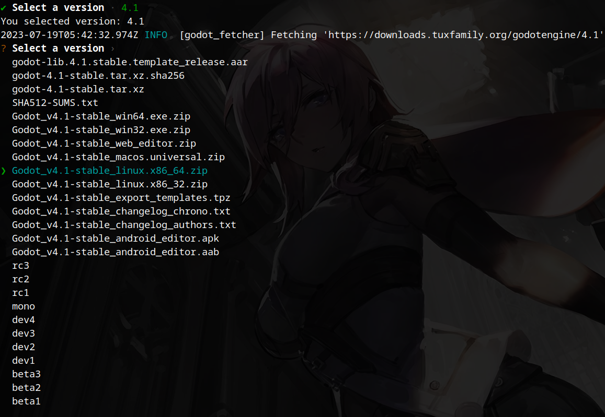
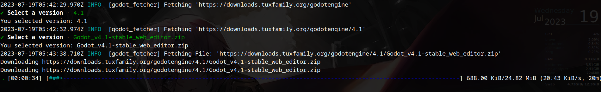

## Godot Engine Fetcher

#### Installation
Either download the binary file github release or
 
Build locally using `cargo`.
- `cargo build`
- `cargo run`

#### 1. Selecting Godot Version

#### 2. Selecting Either Subversion or Download Stable build

#### 3. Downloading in progress

#### 4. After downloading currect directory should have godot engine file. 
